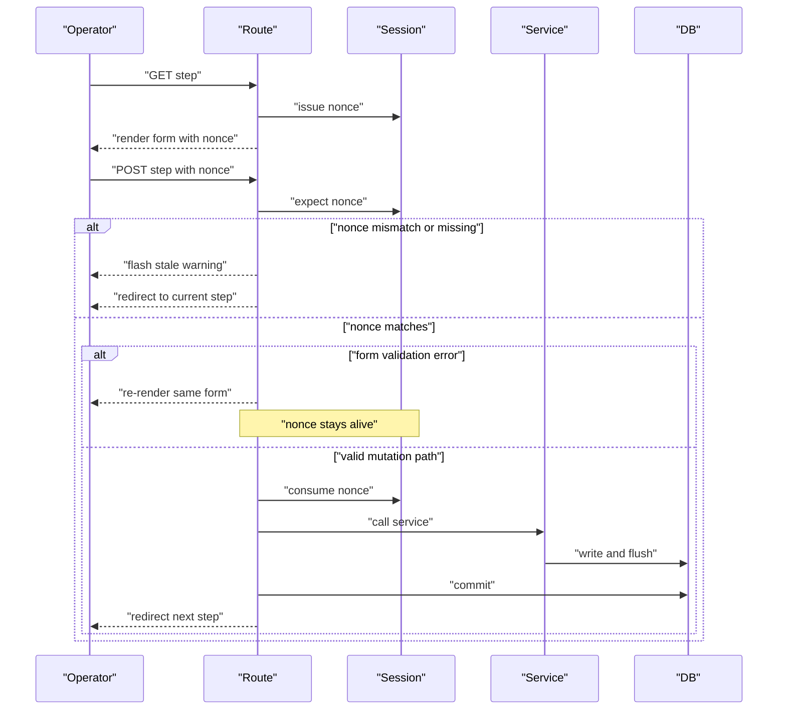
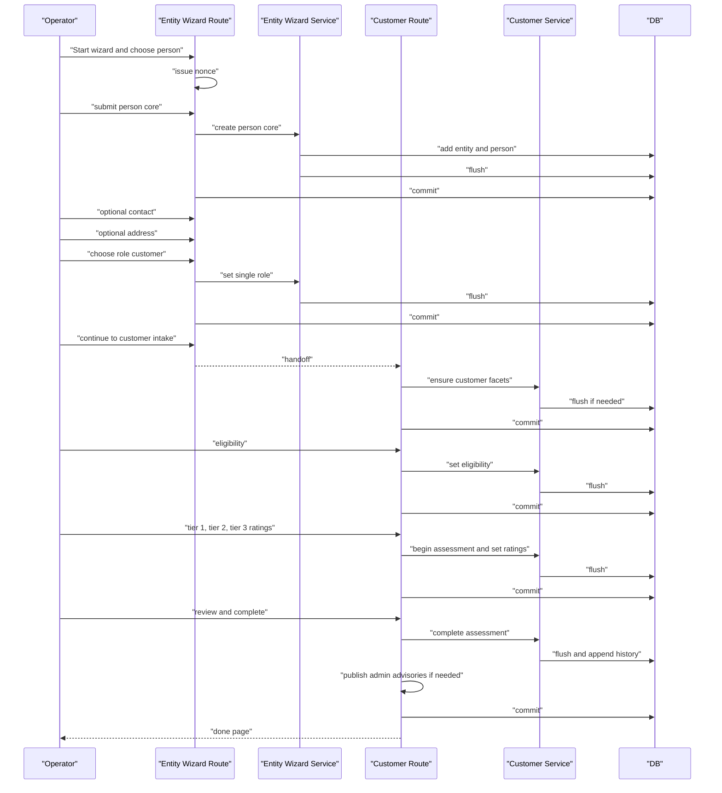

# VCDB v2 Strip Map — Entity Wizard and Downstream Intake Flows

This strip map explains the operator-facing flow for creating four common records:

1. Customer
2. Resource Organization
3. Sponsor Organization
4. Civilian Point of Contact

It is written in plain language, but it stays grounded in the current slice code you uploaded for Entity, Customers, Resources, and Sponsors.

---

## 1. What the Entity Wizard actually is

The Entity Wizard is the **identity intake spine**.

Its job is narrow:

- create a brand-new Entity in a minimally valid state
- optionally gather contact and address information
- assign exactly one initial domain role
- hand the operator off to the next slice flow

It is **not** a general edit tool.
It is **not** the whole Customer, Resource, or Sponsor process.
It is the front door.

The uploaded route inventory also lines up with that split: the Entity Wizard has its own POST surfaces, then hands off to Customer intake or Resource/Sponsor onboarding routes. fileciteturn10file1

---

## 2. The four operator lanes

### Lane A — Customer

- Start Entity Wizard
- Create a **person** entity core
- Optionally add contact
- Optionally add address
- Assign role = `customer`
- Wizard handoff offers **Continue to Customer Intake**
- Customer slice ensures customer facet rows, then walks:
  - eligibility
  - needs tier 1
  - needs tier 2
  - needs tier 3
  - review
  - done

### Lane B — Resource Organization

- Start Entity Wizard
- Create an **org** entity core
- Optionally add contact
- Optionally add address
- Assign role = `resource`
- Wizard handoff offers **Continue to Resource Onboarding**
- Resources slice walks:
  - profile
  - capabilities
  - capacity
  - POCs
  - MOU
  - review
  - complete
- Complete step submits for Admin review

### Lane C — Sponsor Organization

- Start Entity Wizard
- Create an **org** entity core
- Optionally add contact
- Optionally add address
- Assign role = `sponsor`
- Wizard handoff offers **Continue to Sponsor Onboarding**
- Sponsors slice walks:
  - profile
  - POCs
  - funding rules
  - MOU
  - review
  - complete
- In the uploaded route snippet, complete marks the step complete and redirects with a success message that says it was submitted for Admin review. The snippet shown does **not** include a separate admin-review request service call the way Resources does, so that point should be verified in the live code before documenting it as guaranteed behavior.

### Lane D — Civilian Point of Contact

- Start Entity Wizard
- Create a **person** entity core
- Optionally add contact
- Optionally add address
- Assign role = `civilian`
- Wizard handoff offers:
  - **Link as Resource POC**
  - **Link as Sponsor POC**
- Operator chooses an organization ULID and confirms the link
- The target slice creates or ensures its facet row, links the person as POC, emits route-level ledger context, and commits

---

## 3. Entity Wizard step strip map

## Step 0 — Start

### What the operator supplies

- whether the new entity is a **person** or an **organization**

### Why this step exists

- the rest of the wizard depends on entity shape
- person core and org core collect different minimum facts

### Route behavior

- GET shows the start page
- `?reset=1` clears active wizard session state and shows a warning
- POST checks whether a wizard is already active in session
- if active entity still exists, route resumes instead of starting a new one
- if session points at a dead ULID, route clears it and starts fresh

### Writes

- no DB writes
- session may be cleared or resumed

### Commit boundary

- none

### No-op rule

- choosing nothing just flashes an error and redirects back to start

---

## Step 1A — Person core

### What the operator supplies

Required:

- first name
- last name

Optional:

- preferred name
- DOB
- last 4

### Why this step exists

This is the smallest honest identity package for a person entity.

### Route behavior

GET:

- if another wizard is active, resume it instead of starting over
- otherwise issue a nonce and render the form

POST:

- stale-submit guard checks nonce
- invalid/stale nonce sends operator back to wizard start
- form validation errors re-render the same page and keep the nonce
- on valid submit, route consumes the nonce, calls service, then commits
- after commit, route locks session to the created entity and redirects to next step

### Service behavior

- normalizes and validates the optional DOB and last 4
- creates `Entity(kind="person")`
- creates `EntityPerson`
- `db.session.add(...)`
- `db.session.flush()` to obtain the entity ULID
- emits an entity event with **field names only**

### Flush vs commit

- service flushes
- route commits or rolls back

### Ledger/event shape

- operation is `wizard_person_core_created`
- target is the new entity ULID
- changed fields list only includes field names, not values

### Confirmation UX

- success flash with display name
- redirect to contact step
- session stores active entity ULID so the browser can resume safely

---

## Step 1B — Org core

### What the operator supplies

Required:

- legal name

Optional:

- DBA name
- EIN

### Why this step exists

This is the smallest honest identity package for an organization entity.

### Route behavior

Same PRG and stale-submit pattern as person core.

### Service behavior

- normalizes and validates EIN if present
- creates `Entity(kind="org")`
- creates `EntityOrg`
- flushes
- emits `wizard_org_core_created` with field names only

### Flush vs commit

- service flushes
- route commits or rolls back

### Confirmation UX

- success flash with org display name
- redirect to contact step

---

## Step 2 — Contact

### What the operator supplies

Optional:

- email
- phone

### Why this step exists

Contact is helpful but **not required** for minimal intake.
The wizard explicitly supports honest deferral instead of fake placeholder rows.

### Route behavior

GET:

- checks whether this really is the current next step
- if operator deep-links out of order, route redirects them to the right step
- issues entity-scoped nonce and renders the form

POST:

- nonce mismatch means stale page; route redirects to the current step in the flow
- validation errors re-render and keep nonce
- nonce is only consumed on successful mutation path
- route commits, then records session state as either:
  - `provided`
  - `deferred`

### Service behavior

- validates email and phone if present
- if both are empty, returns next step without creating any row
- otherwise creates or updates the primary active contact row
- flushes
- emits `wizard_contact_upserted`

### No-op rule

This step has a real no-op path:

- blank email and blank phone
- no contact row created
- no flush
- no entity event
- operator moves forward honestly

### Confirmation UX

- no separate confirmation page
- simple redirect forward to address step

---

## Step 3 — Address

### What the operator supplies

Usually:

- physical or postal flags
- address1
- address2 optional
- city
- state
- ZIP5

### Why this step exists

Address is often useful, but still not mandatory for minimal intake.

### Route behavior

GET:

- out-of-order access redirects to the true current step
- issues entity-scoped nonce

POST:

- stale nonce redirects to current step
- special `action=skip` path marks address as deferred in session and jumps to role step
- validation errors re-render with same nonce
- successful mutation consumes nonce and commits

### Service behavior

- normalizes boolean flags
- defaults to physical address if neither box is checked
- validates state code and ZIP5
- creates or updates active address row
- flushes
- emits `wizard_address_upserted`

### No-op rule

This step does **not** have a silent blank-form no-op.
Instead it has an **explicit route-level skip path**:

- no DB write
- no flush
- no event
- session state records `address_status=deferred`
- operator moves to role step

### Confirmation UX

- defer path flashes a warning saying address can be added later
- normal path redirects forward to role step

---

## Step 4 — Role

### What the operator supplies

Exactly one role code:

- customer
- resource
- sponsor
- civilian

### Why this step exists

This is the handoff decision.
The role decides which downstream slice owns the rest of the workflow.

### Route behavior

GET:

- guards against out-of-order access
- loads allowed role choices from governance contract
- issues entity-scoped nonce

POST:

- stale nonce redirects to the current step
- validation errors re-render in place
- on success, route consumes nonce, calls service, then commits

### Service behavior

- validates role against governance contract
- archives any currently active role rows
- inserts one new active role row
- if the same active role already exists, returns a no-op DTO and moves on
- flushes
- emits `wizard_domain_role_set`

### No-op rule

This step has a service-level no-op:

- if the requested role is already the active role
- no new role row
- no flush beyond what is already needed elsewhere
- no event from this function path
- route still redirects to wizard-next handoff

### Confirmation UX

- no standalone confirmation page
- immediate redirect to wizard handoff page

---

## Step 5 — Handoff page

### What the operator sees

Based on entity kind and active roles, the wizard offers follow-on actions.

Examples:

- Continue to Customer Intake
- Continue to Resource Onboarding
- Continue to Sponsor Onboarding
- Link as Resource POC
- Link as Sponsor POC
- Done and return to Entity

### Why this step exists

This is the branch point between identity intake and business intake.

### Route behavior

- clears active wizard session if the current entity matches session active entity
- loads active role rows
- builds action list dynamically
- renders a clean choice page rather than auto-forcing every downstream lane

---

## 4. Nonce lifecycle

This is the anti-stale-submit strip.

### Plain-language rule

- **issue** on GET
- **expect** on POST
- **consume only after the route is committed to the success path**
- do **not** consume on validation-error re-render
- stale submit should never quietly write anything

### Practical effect

Back-button re-submit, duplicate tab submit, and old hidden-form replay all land on a warning and a safe redirect instead of double-writing.

---

## 5. Route responsibilities vs service responsibilities

## Routes own

- login / operator surface access
- nonce issuance and stale-submit handling
- form binding and template rendering
- PRG redirects
- commit / rollback
- flashes
- session-backed active entity and wizard progress state
- some route-level orchestration, such as publishing admin advisories after customer completion
- some route-level POC confirmation ledger context

## Services own

- normalization
- validation beyond simple form shape
- DB reads and writes
- `db.flush()`
- event assembly with field names only
- computing next-step DTOs
- no-op detection

## Rule of thumb

- **service flushes**
- **route commits**

That pattern is strong in the uploaded code and is one of the cleanest parts of these flows.

---

## 6. `db.flush()` boundaries vs `db.commit()` boundaries

## Flush happens inside services when

- a new row needs a ULID before redirect or event emission
- the service has assembled enough state to emit a session-bound event
- the slice wants changes visible inside the same transaction for follow-on logic

Typical examples in the uploaded code:

- Entity core creation
- Entity contact upsert
- Entity address upsert
- Entity role assignment
- Customer facet ensure
- Customer eligibility update
- Customer needs begin / update / complete
- Resource and Sponsor onboarding step markers
- Resource/Sponsor POC link/update/unlink services

## Commit happens in routes when

- the whole operator action succeeded
- all route-level orchestration succeeded too
- the route is ready to release control back to the browser with a redirect

## Why this matters

It lets a route coordinate several service calls in one transaction.
If anything later fails, rollback still unwinds the whole unit of work.

Customer completion is a good example:

- service finalizes the assessment and appends history
- route may publish admin advisories
- then route commits once at the end

---

## 7. No-op rules

These are important because they keep the ledger and the database honest.

## Entity wizard no-op examples

### Contact blank

- no contact row created
- no flush
- no event
- move forward to address

### Address deferred by explicit skip

- no address row
- no flush
- no event
- session state records deferral
- move forward to role

### Role already active

- no new role row
- no archive work
- no event from the role service
- move forward to handoff page

## Customer intake no-op examples

### `ensure_customer_facets`

If all three facet rows already exist and nothing changed:

- returns `noop=True`
- no flush
- no event

### `set_customer_eligibility`

If the submitted eligibility state is identical:

- returns `noop=True`
- no flush
- no event

### `needs_begin`

If an assessment is already open and incomplete:

- returns a no-op DTO
- avoids duplicating the 12 rating rows

### `needs_set_block`

If ratings did not change:

- may still advance the intake step if the step itself changed
- if even the step did not change, it is a true no-op

### `needs_complete`

If intake is already complete:

- returns `noop=True`
- no new history write
- no new completion event

---

## 8. Ledger and event assembly

The current pattern is consistent with your canon:

- actor ULID
- request ID
- target ULID
- operation name
- changed field names only
- no PII values in the event payload

### Typical event shape in these flows

- `domain`
- `operation`
- `request_id`
- `actor_ulid`
- `target_ulid`
- `happened_at_utc`
- `changed={"fields": [...]}`
- sometimes `refs={...}` for step, assessment version, or history ULID

### Examples

Entity wizard emits names like:

- `wizard_person_core_created`
- `wizard_org_core_created`
- `wizard_contact_upserted`
- `wizard_address_upserted`
- `wizard_domain_role_set`

Customer intake emits names like:

- `customer_facets_ensured`
- `customer_eligibility_updated`
- `customer_needs_begun`
- `customer_needs_updated`
- `customer_needs_completed`

Resources and Sponsors onboarding emit step markers like:

- `onboard_step`

POC attach flows also add route-level context events such as `contact_upserted` after the link service flushes and before the route commits.

---

## 9. Confirmation UX and resume behavior

## Entity wizard

### Confirmation style

- core steps use success flash plus redirect
- no giant confirmation page mid-stream
- final handoff page acts as the confirmation and next-action chooser

### Resume behavior

- session stores one active entity ULID
- start page resumes active wizard instead of silently starting a new one
- dead session ULID gets cleared and operator is warned
- route-local state tracks whether contact and address were provided or deferred

## Customer intake

### Confirmation style

- each step redirects to next step
- final completion redirects to `done`
- review step is the real operator checkpoint before completion

### Resume behavior

- deterministic step resolver checks customer state and sends the operator to the right current step
- stale posts redirect to the correct live step instead of failing hard

## Resource onboarding

### Confirmation style

- each step saves then moves forward
- complete step is the “submitted for Admin review” confirmation

### Resume behavior

- active entity ULID lives in session
- `wizard_next_step` uses `onboard_step` from Resource row to compute next endpoint

## Sponsor onboarding

### Confirmation style

- same progressive step model
- complete step flashes submitted message and redirects to search filtered to draft/complete

### Resume behavior

- same active-entity session model
- next step derives from Sponsor `onboard_step`

## Civilian POC attach

### Confirmation style

- two-step mini flow
  - choose organization and metadata
  - confirm and commit

### Resume behavior

- not a full wizard with nav state
- more of a confirmation workflow than a long-running staged intake

---

## 10. Sequence diagram for the most common lane — Customer

---

## 11. Per-step checklist — Customer lane

### Entity stage

- choose person
- create person core
- add contact or defer
- add address or defer
- assign role customer
- handoff to customer intake

### Customer stage

- ensure customer facets
- capture eligibility and veteran verification method
- capture housing status
- complete tier 1 needs
- complete tier 2 needs
- complete tier 3 needs
- review dashboard snapshot
- complete intake and generate assessment history
- check whether admin advisories were triggered

---

## 12. Per-step checklist — Resource Organization lane

### Entity stage

- choose org
- create org core
- add contact or defer
- add address or defer
- assign role resource
- handoff to resources onboarding

### Resource stage

- ensure resource facet
- set profile hints
- choose capabilities
- pass through capacity checkpoint
- attach POCs
- set MOU status
- review snapshot
- complete and create admin-review request

### Current code note

The capacity step in the uploaded snippet currently behaves more like a checkpoint than a real data-entry step. It marks the onboarding step and moves on, but the excerpt shown does not persist a separate capacity payload.

---

## 13. Per-step checklist — Sponsor Organization lane

### Entity stage

- choose org
- create org core
- add contact or defer
- add address or defer
- assign role sponsor
- handoff to sponsors onboarding

### Sponsor stage

- ensure sponsor facet
- set profile hints
- attach POCs
- choose capabilities and donation restrictions in funding rules
- set MOU status
- review snapshot
- complete flow

### Current code note

In the uploaded snippet, the sponsor complete step marks the wizard step complete and redirects with a success message. Unlike Resources, the shown snippet does not clearly call a separate admin-review request service. Verify live behavior before documenting that as a hard guarantee.

---

## 14. Per-step checklist — Civilian POC lane

### Entity stage

- choose person
- create person core
- add contact or defer
- add address or defer
- assign role civilian
- handoff to POC attach choice

### Resource POC attach

- open attach screen for civilian person
- enter org ULID
- validate that target is an organization
- confirm scope, rank, primary flag, org role
- ensure resource facet
- link POC via service
- route emits contact-upserted context and commits

### Sponsor POC attach

- same shape as resource attach
- ensure sponsor facet
- link POC via service
- route emits contact-upserted context and commits

---

## 15. The plain-language executive summary

If you need one page to explain this to an operator or successor, it is this:

- The **Entity Wizard** creates the identity record.
- The **role step** decides which business lane owns the rest.
- **Customer** means eligibility plus needs assessment.
- **Resource** means provider onboarding and Admin review.
- **Sponsor** means donor onboarding and funding rules.
- **Civilian** means the person usually becomes a POC for an organization.
- Services do the database work and flush.
- Routes own commit, rollback, redirects, stale-submit protection, and browser flow.
- Optional data is honestly deferred, never faked.
- Ledger and event payloads carry field names and ULIDs, not PII values.

